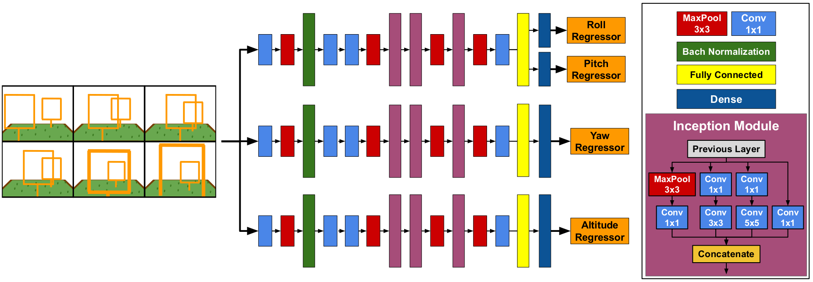
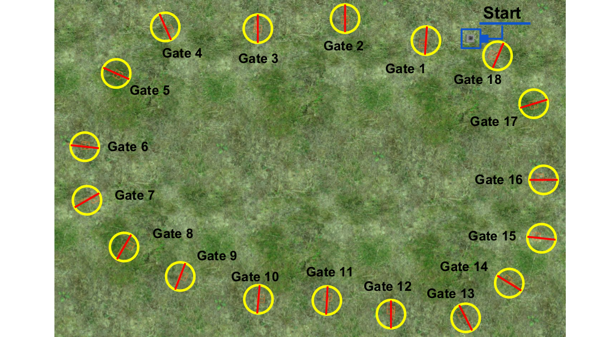
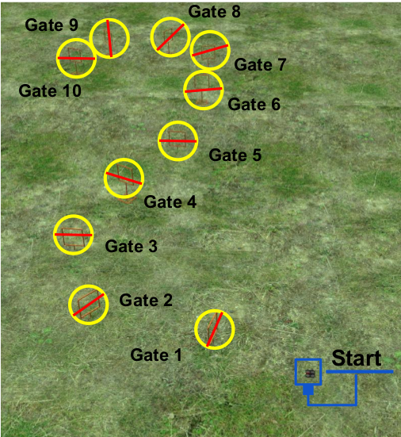
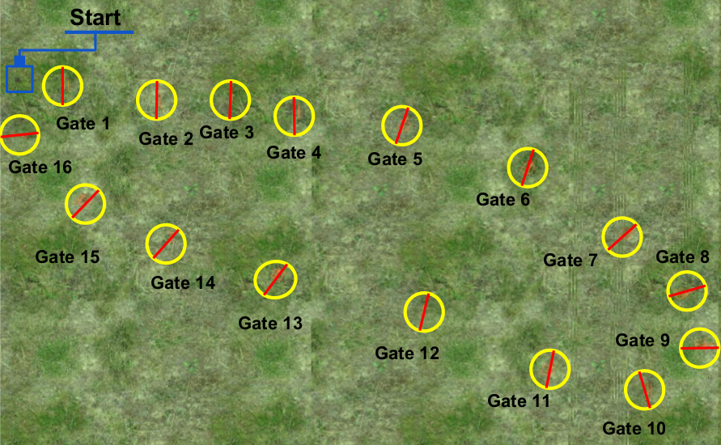

# DeepPilot: A CNN for Autonomous Drone Racing

Autonomous Drone Racing (ADR) was first proposed in IROS 2016. It called for the development of an autonomous drone capable of beating a human in a drone race. After almost five years, several teams have proposed different solutions with a common pipeline: gate detection; drone localization; and stable flight control. Recently, Deep Learning (DL) has been used for gate detection and localization of the drone regarding the gate. However, recent competitions such as the Game of Drones, held at NeurIPS 2019, called for solutions where DL played a more significant role. Motivated by the latter, in this work, we propose a CNN approach called DeepPilot that takes camera images as input and predicts flight commands as output. These flight commands represent: the angular position of the drone’s body frame in the roll and pitch angles, thus producing translation motion in those angles; rotational speed in the yaw angle; and vertical speed referred as altitude h. Values for these 4 flight commands, predicted by DeepPilot, are passed to the drone’s inner controller, thus enabling the drone to navigate autonomously through the gates in the racetrack. For this, we assume that the next gate becomes visible immediately after the current gate has been crossed. We present evaluations in simulated racetrack environments where DeepPilot is run several times successfully to prove repeatability. In average, DeepPilot runs at 25 frames per second (fps). We also present a thorough evaluation of what we called a temporal approach, which consists of creating a mosaic image, with consecutive camera frames, that is passed as input to the DeepPilot. We argue that this helps to learn the drone’s motion trend regarding the gate, thus acting as a local memory that leverages the prediction of the flight commands. Our results indicate that this purely DL-based artificial pilot is feasible to be used for the ADR challenge.

<p align="center">
  
</p>

## Overview of our approach
<p align="center">
  
</p>

It consists of 4 steps: (1) Data acquisition using the drone’s onboard camera; (2) Real-time mosaic generation, consisting of 6 frames; (3) Flight commands prediction using our proposed CNN named DeepPilot, these commands are represented by the tuple (ϕ,θ,ψ,h); (4) Implementation of a filter to smooth the signal.

## DeepPilot Architecture
Our proposed DeepPilot runs 3 specialized models in parallel. The first one predicts ϕ and θ angular positions of the body frame; the second one predicts ψ, the rotational speed over the Z-axis; and the third one predicts h, the vertical speed. The size of the kernels is indicated in the colored boxes at the bottom-left.

<p align="center">
  
</p>

## Video
A video of this approach can be watched at: https://youtu.be/Qo48pRCxM40.

[](https://www.youtube.com/watch?v=YD5oqe8DelE)

[](https://www.youtube.com/watch?v=YD5oqe8DelE)
[](https://www.youtube.com/watch?v=YD5oqe8DelE)

## Recommended system
- Ubuntu 20.04
- ROS Noetic + Gazebo 11
- Python 3
- Cuda 11.6
- Cudnn 8.3.2
- Tensorflow 2.08
- Keras 2.08
- rotors_simulator ported to noetic (https://github.com/simonernst/iROS_drone)

# Installation

## Rotors Simulator

```bash
mkdir -p bebop_ws/src && cd bebop_ws/src

sudo apt install build-essential python3-rosdep python3-catkin-tools
sudo apt install libusb-dev python3-osrf-pycommon libspnav-dev libbluetooth-dev libcwiid-dev libgoogle-glog-dev
sudo apt install ros-noetic-mavros ros-noetic-octomap-ros 

git clone https://github.com/ethz-asl/mav_comm
git clone -b noetic https://github.com/simonernst/iROS_drone
git clone https://github.com/ros-drivers/joystick_drivers

cd ..
catkin_make
```

## DeepPilot

```bash
git clone -b Noetic https://github.com/QuetzalCpp/DeepPilot.git
cd DeepPilot
bash setup.sh 
cd ..
catkin_make
```

### Additional Resources
- [DeepPilot Models pretrained](https://inaoepedu-my.sharepoint.com/:f:/g/personal/carranza_inaoe_edu_mx/EslxVDqc9zBMmiV4mDH48KUBAcAHu0Ypt1rZLL6ifOjyoA?e=VYtMyT)
- [Datasets to train DeepPilot](https://inaoepedu-my.sharepoint.com/:f:/g/personal/carranza_inaoe_edu_mx/EslxVDqc9zBMmiV4mDH48KUBAcAHu0Ypt1rZLL6ifOjyoA?e=VYtMyT)

### Train DeepPilot

```bash
cd /bebop_ws/src/DeepPilot/DeepPilot_network
python train_deeppilot.py
```

### Start DeepPilot

```bash
cd /bebop_ws/src/DeepPilot/DeepPilot_network
python evaluation_mosaic-6img.py
```
***Note: DeepPilot models were trained with another package to simulate the ardrone, so it is recommended to adjust the flight commands predicted by DeepPilot for this new platform (bebop2), as it has a higher speed than when flying in the tum_simulator platform.***

### Start keyboard

```bash
cd /bebop_ws/
source devel/setup.bash 
rosrun keyboard keyboard
```
| Key | Description | --- | Key | Description |
| --- | --- | --- | --- | --- | 
| T | Takeoff | --- | Space Bar | Land |
| A | Roll (+) | --- | D | Roll (-) |
| W | Pitch (+) | --- | S | Pitch (-) |
| Q | Yaw (+) | --- | E | Yaw (-) |
| Up (arrow key)| Altitude (+) | --- | Down (arrow key)| Altitude (-) |
| Left (arrow key)|  Speed (-) | --- | Right (arrow key)|  Speed (+) |
| X | Autonomous MODE | --- | C | Manual MODE |

DeepPilot control is activated by pressing the X key.

The DeepPilot control can be cancelled at any time by pressing the C key.

### Start the simulator mode

```bash
cd /bebop_ws/
source devel/setup.bash 
roslaunch rotors_gazebo bebop_racetrack1.launch
```
<p align="center">
  
</p>

```bash
roslaunch rotors_gazebo bebop_racetrack2.launch
```
<p align="center">
  
</p>

```bash
roslaunch rotors_gazebo bebop_racetrack3.launch
```
<p align="center">
  
</p>

## Reference
If you use any of data, model or code, please cite the following reference:

Rojas-Perez, L.O., & Martinez-Carranza, J. (2020). DeepPilot: A CNN for Autonomous Drone Racing. Sensors, 20(16), 4524.
https://doi.org/10.3390/s20164524

```
@article{rojas2020deeppilot,
  title={DeepPilot: A CNN for Autonomous Drone Racing},
  author={Rojas-Perez, Leticia Oyuki and Martinez-Carranza, Jose},
  journal={Sensors},
  volume={20},
  number={16},
  pages={4524},
  year={2020},
  publisher={Multidisciplinary Digital Publishing Institute}
}
```
## Related References

- L. O. Rojas-Perez and J. Martinez-Carranza, "Autonomous Drone Racing with an Opponent:  A First Approach",Computación y Sistemas (2020).
```
@article{rojas2020ADRwithop,
  title={Autonomous Drone Racing with an Opponent:  A First Approach},
  author={Rojas-Perez, Leticia Oyuki and Martinez-Carranza, Jose},
  journal={Computaci{\'o}n y Sistemas},
  volume={},
  number={},
  year={2020}
}
```

- A. A. Cabrera-Ponce, L. O. Rojas-Perez, J. A. Carrasco-Ochoa, J. F. Martinez-Trinidad and J. Martinez-Carranza, "Gate Detection for Micro Aerial Vehicles using a Single Shot Detector," in IEEE Latin America Transactions, vol. 17, no. 12, pp. 2045-2052, December 2019, doi: 10.1109/TLA.2019.9011550.

```
@ARTICLE{9011550,
  author={A. A. {Cabrera-Ponce} and L. O. {Rojas-Perez} and J. A. {Carrasco-Ochoa} and J. F. {Martinez-Trinidad} and J. {Martinez-Carranza}},
  journal={IEEE Latin America Transactions}, 
  title={Gate Detection for Micro Aerial Vehicles using a Single Shot Detector}, 
  year={2019},
  volume={17},
  number={12},
  pages={2045-2052},}
```

- L. O. Rojas-Perez and J. Martinez-Carranza, "A Temporal CNN-based Approach for Autonomous Drone Racing," 2019 Workshop on Research, Education and Development of Unmanned Aerial Systems (RED UAS), Cranfield, United Kingdom, 2019, pp. 70-77, doi: 10.1109/REDUAS47371.2019.8999703.
```
@INPROCEEDINGS{8999703,
  author={L. O. {Rojas-Perez} and J. {Martinez-Carranza}},
  booktitle={2019 Workshop on Research, Education and Development of Unmanned Aerial Systems (RED UAS)}, 
  title={A Temporal CNN-based Approach for Autonomous Drone Racing}, 
  year={2019},
  volume={},
  number={},
  pages={70-77},}
```

- J. A. Cocoma-Ortega, L. O. Rojas-Perez, A. A. Cabrera-Ponce and J. Martinez-Carranza, "Overcoming the Blind Spot in CNN-based Gate Detection for Autonomous Drone Racing," 2019 Workshop on Research, Education and Development of Unmanned Aerial Systems (RED UAS), Cranfield, United Kingdom, 2019, pp. 253-259, doi: 10.1109/REDUAS47371.2019.8999722.

```
@INPROCEEDINGS{8999722,
  author={J. A. {Cocoma-Ortega} and L. O. {Rojas-Perez} and A. A. {Cabrera-Ponce} and J. {Martinez-Carranza}},
  booktitle={2019 Workshop on Research, Education and Development of Unmanned Aerial Systems (RED UAS)}, 
  title={Overcoming the Blind Spot in CNN-based Gate Detection for Autonomous Drone Racing}, 
  year={2019},
  volume={},
  number={},
  pages={253-259},}
```

 ## Acknowledgements
We are thankful for the processing time granted by the National Laboratory of Supercomputing (LNS) under the project 201902063C. The first author is thankful to Consejo Nacional de Ciencia y Tecnología (CONACYT) for the scholarship No. 924254. We are also thankful for the partial financial support granted via the FORDECYT project no. 296737 “Consorcio en Inteligencia Artificial” for the development of this work.


